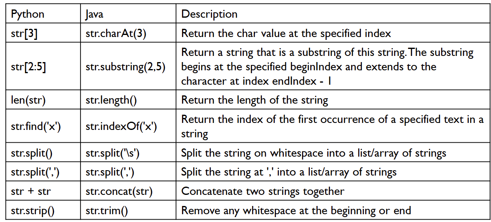
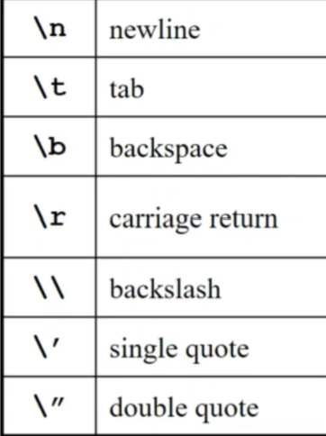
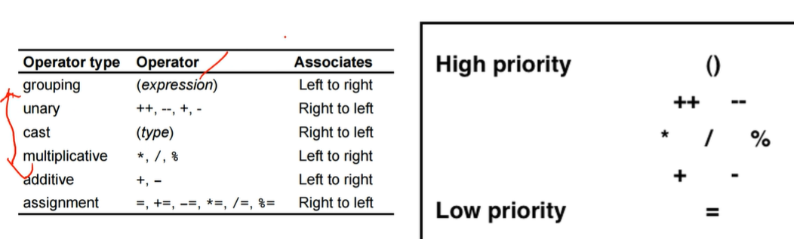
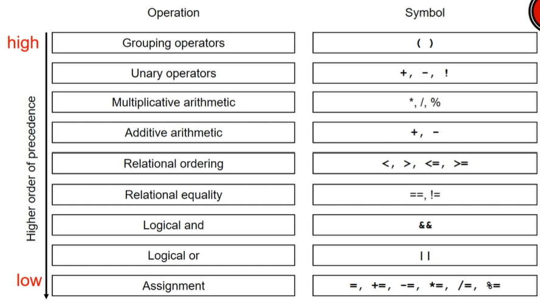

# 下载 Java（JDK）
注意：JDK=运行+编译，JRE=只运行
- 官网下载最新版
- 配置环境变量（optional）：控制面板-系统-高级系统设置-系统环境变量-PATH

检验：win + R + cmd 打 `javac + 回车`

# 杂七杂八
## round
```Java
// 向上取整 double
Math.ceil(number);

// 向下取整 double
int a / b; //ab=int
Math.floorDiv(a, b);

// 四舍五入
Math.round(number);
```
## Math
```Java
Math.abs() 绝对值int
Math.max()/Math.min() 最大/最小 
Math.round() 四舍五入int
Math.sqrt() 平方根 
Math.pow() 幂double
```
## String Class
char ascii (A=65 a=97) <-> int/double
```Java
String string = "a";
// string -> int/double
// static method, provided by string class
Integer.parseInt(string); 
Double.parseDouble(string);

//int -> string
Integer.toString(integer);
String.valueOf(integer)

// string method
// instance method, provided by string
.split(分割物) // return array of substrings
.charAt(index) //return string
.substring(start, end+1) // return substring
.length()
.equal(另一个string) //比较内容
```


## StringBuffer Class
mutable
```Java
StringBuffer stringbuffer = new StringBuffer(word);

.append(data);
.reverse();
.toString();
```

# Lab1 

## Variable & Literal
```Java
// 先声明class
int x = 1
int x 
x = 1
// final=constant不可修改
final int x = 1
```


## 变量类型：Ptimitive Data Type
存储数据本身：`byte short int long double float boolean char`

### Integer Data Type
byte(1 byte) < short(2 byte) < int(4 byte) < long(8 byte)

不能用，. 0开头

### Floating Point Data Type
- double（默认小数类型）：8 byte 15位小数
- float：4 byte 7位小数

```Java
double d = 12.7;   // 正常
float f = 12.7;    // ❌ 会报错！因为 12.7 默认是 double
float f = 12.7f;   // ✅ 需要在数字后面加 f，明确告诉编译器这是 float

double a = 1.2E5; //科学计数法
```

### Boolean & Char Data Type
```Java
true false //小写
'a' //单引号 单字母：char
"hello" // string
```

## 变量类型：Reference Types
除了primitive type 都是 reference type，存储 address。只有reference type 可被调用method，primitive type 不能用 method
- array class enumeration（代表一组 constants 的 class）
```Java
className variableName = new createClassObject(参数)

String s1 = new String("candide");
String s2 = s1.replace('d', 'p'); // 创建了新的string

enum Level{
    LOW,
    MEDIUM,
    HIGH
};
Level myVar = Level.MEDIUM;
```

- Reference Type：数量无限，memory里是地址，赋值时多个变量指向同一个对象（地址）
- Primitive Type：数量有限，memory里是数据，赋值时创建副本

## 类型转换
### Implicit
小 - 大：直接换
```Java
double d = 4.9;
int i = 10;
double d1, d2;

d1 = i; // d1=10.0
d2 = (double) i;
```

### explicit
大 - 小：加（类型）
```Java
double d = 4.9;
int i = 10;
int i2= (int) d;
```

## Console Output
### printf() & printIn()
```Java
System.out.printf(模板 [值，值，值]);
System.out.printf("%.2f...%.3f..", num1, num2)
System.out.println("")// 自动换行
```
Format：%（格式开始符）+ 转换符

`%[对齐方式：-是左对齐，什么都不加是右对齐][width：一个整数][.precision][参数大小]转换符`


放在output里：


## Get Input
```Java
// 导入Scanner class
import java.util.Scanner;

// new: create object
// System.in = keyboard
Scanner console = new Scanner(System.in);

int age = console.nextInt();
```
```Java
// read input
.nextInt()
.nextDouble()
.next()
.nextLine()
```

## 运行
```Java
public class [fileName]{
    public static void main(String[] args){
        System.out.printIn("hello");
    }
}
//system: class
//out: object
// printIn: method
```

# Lab 02
## Operator
Arithmetic：+ - * / % （注意：* /如果两个运算数都是int，结果自动只保留 int part; + 遇见 string 自动变拼接； %结果符号和被除数一致）

Unary：+（正） -（负） ++（自增1） --（自减1） !（BOOL取反）
- i++：先赋值，再自增
- ++i：先自增，再赋值
```Java
int i = 0, j = -1;
j = i++; // j = 0, i = 1
```

Multiple Assignment：`s = 5 + (t = 4);`

Relational & Logical （NO CHAINED）: == >= <= ！（NOT）&&（AND） ||（OR）  

处理顺序：
 

Short Circuit：逻辑判断，如果一个够用就不检查第二个

## Control Structure
``` Java
if (condition){
    statement;
} else if{
    statement;
} else{
    statement;
}
// else跟着最近的if
```
？（只有一对 if else）：`boolExpression ? valueIfTrue : valueIfFalse`

``` Java
switch (parameter)
{
    case A:
        statement;
    case B:
        statement;
        break
    default:
        statement;
}

switch (parameter)
{
    case A -> statement;
    case B -> statement; // 省略了 break
    default -> statement;
}
// 从第一个合适的 case 进入，从第一个 break 跳出
```
